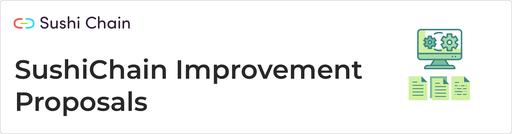

Welcome to the SIPS repository where community members can propose changes to the SushiChain protocol and its software implementation.

## Contributing

Before contributing please read carefully the following [guidelines](proposals/sip-0001.md).

If you have any questions on how to proceed with a new or existing proposal, please contact the SIPs editor at [info@sushichain.io](mailto:info@sushichain.io).

## Proposals

| Number                        | Title                                                                    | Author                                       | Type            | Status        |
| ------------------------------|------------------------------------------------------------------------- | -------------------------------------------- | ----------------|---------------|
| [0001](proposals/sip-0001.md) | SIP purpose and guidelines                                               | SushiChain Foundation                              | Process         | Active        |